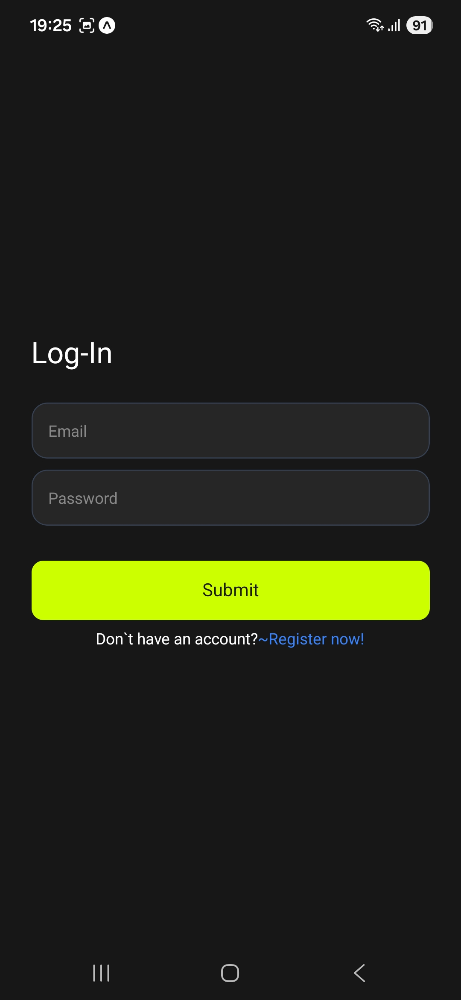
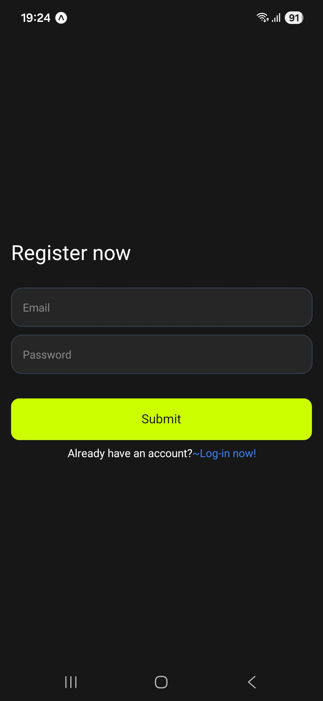
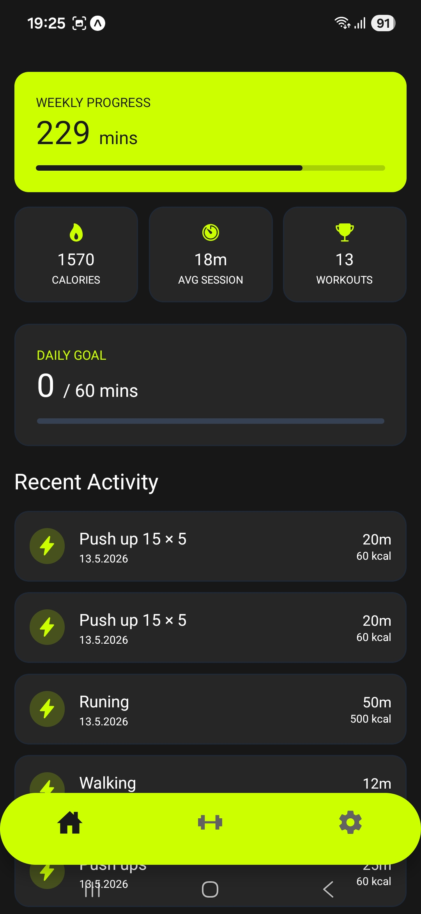
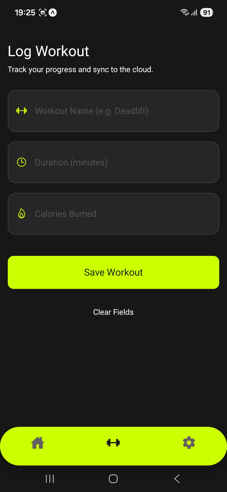
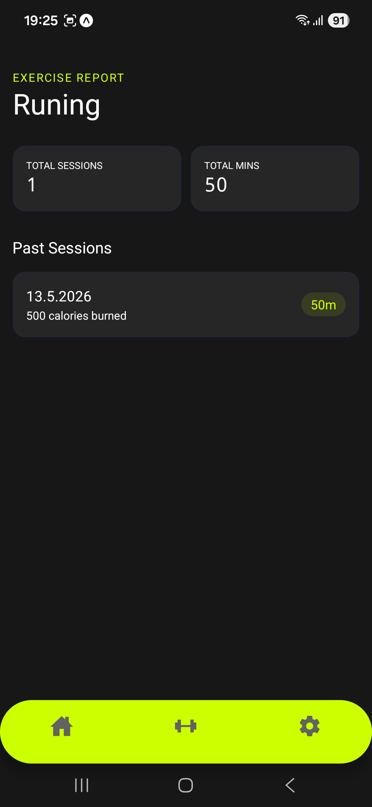
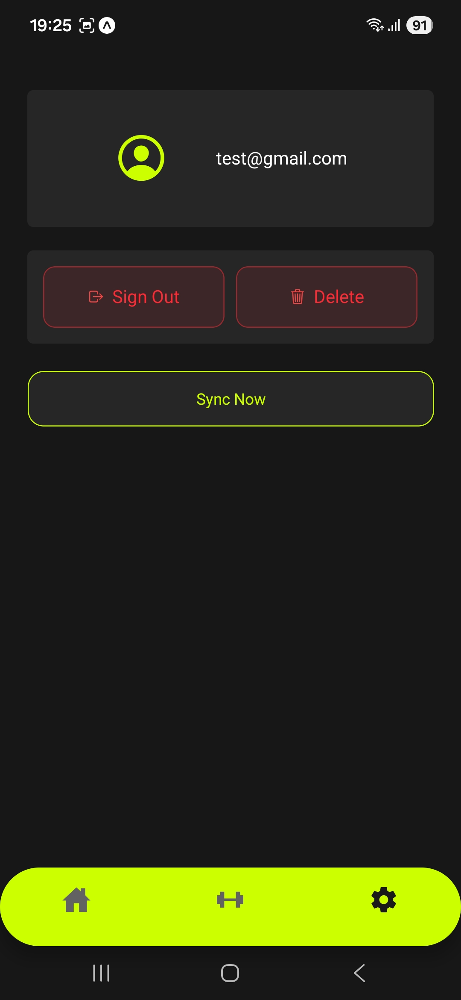

# Project Overview: Fitness Tracker App
This application is a cross-platform fitness companion designed to help users log workouts, track progress, and ensure data integrity through an "Offline-First" architecture. It allows users to monitor their weekly and daily goals while maintaining a history of specific exercise types.

# Key Features & Functionality
1. Secure Authentication
Login & Sign-Up: Secure entry point for users to create accounts or access existing data.

User Persistence: Tracks the current user's session and displays their email in the settings.

Account Management: Users can safely sign out or delete their account directly from the settings menu.

2. Dashboard (Home Tab)
Progress Tracking: Visualizes weekly minutes spent exercising and calories burned.

Dynamic Stats: Displays total calories, average session duration, and total workout count for quick reference.

Recent Activity: A list of the most recent workouts with a quick-glance view of the date, duration, and calories.

Goal Monitoring: Tracks daily exercise minutes against a set goal with a visual progress bar.

3. Workout Logging (Exercises Tab)
New Entry: Users can log a workout by entering the exercise name, duration (minutes), and calories burned.

Real-time Feedback: Features a "Saving..." state during the process and a "Clear Fields" option for quick resets.

Achievements: Integrated logic to trigger achievement modals when specific milestones are met.

4. Exercise Analytics (Detail View)
Specific Reporting: By clicking on a workout in the dashboard, users are taken to a detailed report for that specific exercise type.

Historical Data: Shows a comprehensive list of every past session for that exercise, including dates and specific metrics.

5. Settings & Cloud Sync
User Profile: Displays the logged-in user's credentials.

Manual Sync: Includes a "Sync Now" feature to manually push locally saved data to the cloud database.

# Technical Architecture
## Offline-First Data Strategy
The app is engineered to be fully functional without an internet connection.

1. Local Storage: Workouts are saved immediately to the device using AsyncStorage.

2. Background Syncing: Cloud writes to Firebase are performed as non-blocking background tasks. This prevents the UI from hanging if the network is disconnected.

3. Conflict Resolution: The app tracks a synced status for every workout to ensure that data is uploaded to the cloud once a connection is restored.

# Responsive Web Design
While built with React Native, the app is fully optimized for web deployment:

Max-Width Containers: Content is constrained to a maximum width (e.g., 800px) on large screens to prevent layout stretching.

Centered Layouts: Forms and dashboards are centered automatically on desktop browsers for a professional look.

Adaptive Navigation: The floating tab bar is restricted in width and centered on the web, maintaining the aesthetic of a mobile app.

# Tech Stack
Frontend: React Native / Expo

Styling: NativeWind (Tailwind CSS for React Native)

Backend: Firebase Firestore & Authentication

Local Storage: AsyncStorage

Icons: Ionicons

# Screenshots
## Auth

## Home 

## Exercise

## Settings 

